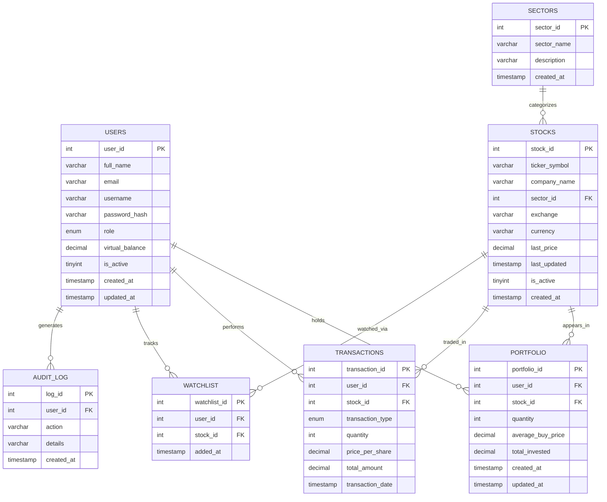

# Entity-Relationship Diagram (Mermaid)

Paste this block into [mermaid.live](https://mermaid.live) or any Markdown
viewer that supports Mermaid (GitHub, VS Code with Mermaid extension, Notion,
etc.) to render the diagram visually for your report/PPT.

## Relationship Summary

| Relationship | Cardinality | Description |
|---|---|---|
| USERS → PORTFOLIO | 1 : N | A user can hold many stocks; each portfolio row belongs to exactly one user |
| STOCKS → PORTFOLIO | 1 : N | A stock can be held by many users |
| USERS → TRANSACTIONS | 1 : N | A user can make many buy/sell transactions |
| STOCKS → TRANSACTIONS | 1 : N | A stock can be involved in many transactions |
| USERS → WATCHLIST | 1 : N | A user can watch many stocks |
| STOCKS → WATCHLIST | 1 : N | A stock can be watched by many users |
| SECTORS → STOCKS | 1 : N | A sector contains many stocks; a stock belongs to one sector |
| USERS → AUDIT_LOG | 1 : N | Each audit entry optionally traces back to the acting user |

**Composite/derived entity:** `PORTFOLIO` and `WATCHLIST` are classic
resolution tables for the underlying **many-to-many** relationship between
`USERS` and `STOCKS` ("a user can own/watch many stocks" and "a stock can be
owned/watched by many users"). `TRANSACTIONS` is the immutable event log
behind that same M:N relationship.
